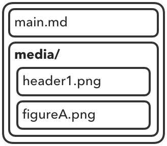
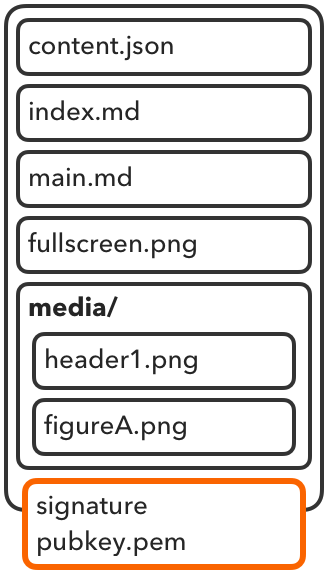

# Letterdown Document Format

The simplest Letterdown document is just a gzipped TAR archive with the `ltd` extension, containing a single markdown file and an optional folder of images:



```bash
$> tar -cvz -f "project.ltd" --format=ustar main.md media
```

Congratulations; This is a valid, distributable Letterdown file.

> The `ustar` format is part of the POSIX.1-1988 specification; It is generally the most portable format for TAR archives.

## Main Content Sequence

All Letterdown documents have an implicit **main content sequence**: the set of all regular files in the archive root, excluding `context.json` and `index.md`, in archival order. Files in the main content sequence *must* be added to the archive in the intended order of presentation. Neither directories nor their contents are included in the main content sequence.

```bash
# The user will be shown 'part1.md' followed by 'part2.md'
# Files in media/ are only shown when linked
$> tar -cvz -f "project.ltd" --format=ustar part1.md part2.md media
```

## index.md

The main content sequence *should* always be preceded by an `index.md` that serves as a title page / table of contents. When present, `index.md` must link to all files in the main content sequence, in archival order.

All markdown files, including and especially `index.md`, may link directly to additional content files in subdirectories – for example, a bibliography, author bio, or an image of a map. Even when the main content sequence is a single file, `index.md` may be useful to display authorship or copyright information, and link to embedded and/or external resources.

```bash
# Content files must be added to the archive in presentation order
$> tar -cvz -f "project.ltd" --format=ustar index.md part1.md part2.md media appendices
```

Software that displays Letterdown documents should provide quick access to `index.md` via the user interface at all times.

#### Example: `index.md`

The following example shows an `index.md` for a single-page document, with extra information *outside* the main content sequence, both before and after the main document. Markdown files in subfolders are not part of the main content sequence, so a user opening this document would be shown `presentation.md` until and unless they view `index.md`.

Here, `index.md` displays artwork, the document title, copyright, and author information directly, and links to additional documents outside the main content sequence:

```markdown

# Title of Work

**©2020 Author**

Written from Anywheresville, CA

- [Introduction](extras/introduction.md)
- [Main Presentation](presentation.md)
- [Addenda](extras/addenda.md)
```

## context.json

`context.json` contains structured metadata that places the current document into a larger context. This may identify the document as a fragment of a larger work, or cite other letterdown documents for user verification / interest.

####  Fields

- **title**: The title of the document or collection.
- **url**: A globally unique identifier for this document. It is strongly recommended that the document be published at this URL. See the [FAQ](faq.md) for info on recommended hosting practices.
- **collection**: An optional, ordered array of all URLs that precede the current document in a collection. Each URL must be a Letterdown document signed with the keypair as the current document, and the current document must contain an `index.md` that covers all content in the collection (see below)
- **references**: A list of other documents and information useful in verifying their relevance and/or authenticity. References have the following fields:
  - **title**: A user-visible description of the document being linked.
  - **url**: The URL of the target document.
  - **digest**: Optional. The `sha256` digest of the referenced document, as calculated for a digital signature (below), rendered as a lowercase hexadecimal string. For documents that are not Letterdown documents, this field must be omitted.

#### Example: `context.json`

A simple `context.json` may specify only the document's title and url. This example cites an academic paper and includes its cryptographic hash, so users may detect if the document matches the version referred to here:

```json
{ "title": "My Awesome Memo",
  "url": "letterdown.com/35A529EF-344B-4CB0-A7B6-AC496B343EA0",
  "references": [
    { "title":"R Hendricks and E Bachman, et al. \"Adversarial Compression for Peer-to-Peer Networks\"",
      "url":"domain.org/48C523A4-D3AF-4A5E-A840-C37753929FA4",
      "digest":"e3b0c44298fc1c149afbf4c8996fb92427ae41e4649b934ca495991b7852b855",
    }
  ]

}
```

### Collections

When a document is the latest in a series – a new chapter in a serially-published book, or the latest article in a set – it may be distributed with a separate unique ID, incorporating the previous documents by reference. In applications that support Letterdown, provided all the referenced documents are signed with the same public key, all of the previous documents should be masked by the latest one.

Only the latest document's `context.json` and `index.md` are used. The main content sequence should be constructed from the links present in `index.md` whenever possible.

#### Example: `context.json` for a collection

In this example, previous documents are incorporated by reference. The collection will be presented to users as a single document when possible.

```json
{ "title": "Compressing Letterdown Document Caches (Series)"
  "url": "letterdown.com/A4FC6532-EC4D-4012-8366-859903D49149",
  "collection": [
    "letterdown.com/54F42C5F-7B3D-4F63-BF22-FA0D8A1764ED",
    "letterdown.com/8F95E2FA-728B-4F36-84D5-9107A11ECA33"
  ]
}
```

#### Example: `index.md` for a collection

When viewing a collection, only the `index.md` of the latest document is used. `index.md` must refer to content in other documents using their complete URLs:

```markdown
## A Midnight Tale

A work in progress. Thanks, as always, to my patrons! 🙇

- [Introduction](letterdown.com/54F42C5F-7B3D-4F63-BF22-FA0D8A1764ED/Introduction.md)
- [Chapter 1: Patter](letterdown.com/54F42C5F-7B3D-4F63-BF22-FA0D8A1764ED/Chapter 1.md)
- [Chapter 2: Forward](letterdown.com/6A67B622-B4E1-4B92-9156-0883A994E390/Chapter 2.md)
- [Chapter 3: Curiosities](Chapter 3.md)
- [Note to Readers](extras/Progress Note.md)
```

By linking to content in previous documents this way, users and client software can construct a navigable copy of the entire series by unarchiving all of the collection's previous documents into the root of the newest one.

This also allows the newest document to choose which previous documents are used – in the example above, `extras/Progress Note.md` may be included in every document in the series, and this allows the newest document to specify which file is displayed without complicated rules for masking or ignoring previous versions. 

### Signing

After the document contents are finalized, a signature may be generated and appended to it:

```bash
$> openssl dgst -sha256 -sign /path/to/private.key -out signature project.ltd
```

Then, the archive, signature, and public key are combined into a new archive:

```bash
$> tar -cvz -f "signed.ltd" @project.ltd signature pubkey.pem
```

When successful, the archive contents are properly ordered, and all files are present:

```bash
$> tar --list -f signed.ltd
./
context.json
index.md
main.md
extras.md
media/
signature
pubkey.pem
```

### Final Structure

The following image shows the archive structure for a signed document with `context.json`, `index.md`, an image in the main content sequence, and a folder with additional image resources. The main content sequence is [`main.md`,`fullscreen.png`].



### File Lists

On most platforms, `tar` supports creating an archive using a plain text listing of input files:

```bash
# -n (--no-recursion) prevents hidden files (.DS_Store, etc.) from being added
$> tar -cvz -f "project.ltd" --format=ustar -n -T files-list.txt
```

See the current document's [file-list.txt](build/file-list.txt) for an example.

### Verifying the signature

Digital signatures are embedded in the file for ease of distribution and for easy verification in client programs. There are a few steps to command-line verification, but it's still quite straightforward:

```bash
# Create verify.ltd as an uncompressed clone of signed.ltdz, excluding signature and pubkey.pem
$> tar -c --exclude signature --exclude pubkey.pem -f verify.ltd @signed.ltdz
# Extract just the signature and public key files from the archive
$> tar -x -f signed.ltdz signature pubkey.pem
$> openssl dgst -sha256 -verify pubkey.pem -signature signature verify.ltd
Verified OK
```

#### Verifying signatures in applications

In an application, the verification process is very similar. All uncompressed bytes from the source archive are added to a SHA256 digest until the header for the `signature` file is encountered. A final 1024 padding bytes are added to the digest, as per the TAR format. Finally, the digest's sum is verified against the contents of the signature file.

// TODO: Include a golang program to verify *.ltd signatures
